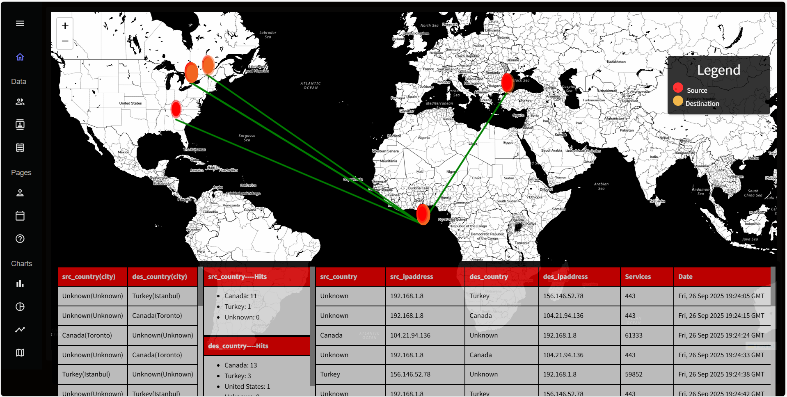

# Ollama IDS Frontend

This frontend, built with React and Vite, serves as the user interface for the Ollama LLM-based Intrusion Detection System (IDS). It provides real-time visualization of network traffic, categorizes attacks into R2L, U2L, Probe, and DDoS types, and displays related CVEs using the underlying Neo4j knowledge graph. Additionally, it integrates Ollama LLM to generate clear, human-readable incident reports, making it easier for analysts to monitor, understand, and respond to network threats efficiently.
